# Why 

- automatising tests on a *different* machine (or )
- following the appliance of your project's guidelines (coverage, lints...)
- automatising tasks like deploying to production 
- be more secure about your code 
- gain time (parallel build on several machines for instance)

# When

Building a CI is not time-consuming, in fact creating tests are. 

In general, I would say that the main drawback from creating a CI for each project is the need of resources it demands
and the cost it may produce.

In very active projects, it offers you the ability to create value quicker as you are more confident about your code
and less afraid at the idea of rewriting something.

I would therefore recommend creating a CI for each project you want to actively maintain. For others, a simple test suite
may be enough.

# What 

There is many solutions out there. The most famous are GitLab CI, CircleCI and GitHub Actions.
While the choice between GitHub and Circle Ci may be easy as it depends on your project's location, CircleCI still
is an option you shouldn't overlook.

# How

To use Gitlab CI, you must:

- create a "runner" 
- create a `.gitlab-ci.yml` file in the root directory

... and you're done !

## Create a runner

Go to `Settings > CI/CI #Runners`
And follow these instructions: https://docs.gitlab.com/runner/install/

Eventually run the docker locally using https://stackoverflow.com/a/65920577

## Create a `.gitlab-ci.yml` file

```
stages:
  - build
  - test
  - deploy

image: alpine

#############################

build_a:
  stage: build
  script:
    - echo "This job builds something."

build_b:
  stage: build
  script:
    - echo "This job builds something else."

###############################

test_a:
  stage: test
  script:
    - echo "This job tests something. It will only run when all jobs in the"
    - echo "build stage are complete."

test_b:
  stage: test
  script:
    - echo "This job tests something else. It will only run when all jobs in the"
    - echo "build stage are complete too. It will start at about the same time as test_a."

###############################

deploy_a:
  stage: deploy
  script:
    - echo "This job deploys something. It will only run when all jobs in the"
    - echo "test stage complete."

deploy_b:
  stage: deploy
  script:
    - echo "This job deploys something else. It will only run when all jobs in the"
    - echo "test stage complete. It will start at about the same time as deploy_a."
```

### Basic pipeline

To begin with, we need to create a clear stage process.

```
stages:
  - build
  - test
  - deploy
```

With this part of code, we ensure that all tasks assigned to the `test` stage will run once all tasks in the previous 
`build` stage have been runned. Likewise, we want to run our `deploy` tasks after the `test` tasks have been runned.
Note that all tasks in the same stage run concurrently.

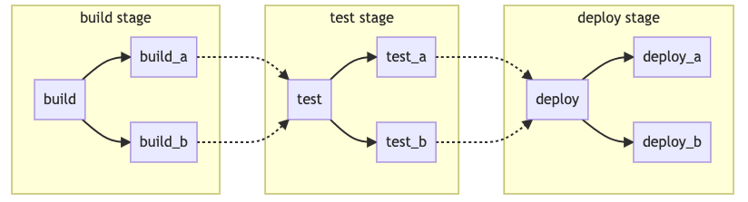

This behavior can be improved through DAG [Directed Acyclic Graph](https://docs.gitlab.com/ee/ci/directed_acyclic_graph/)
or child/parents pipelines by waiting only for desired builds and bringing common behaviors together.

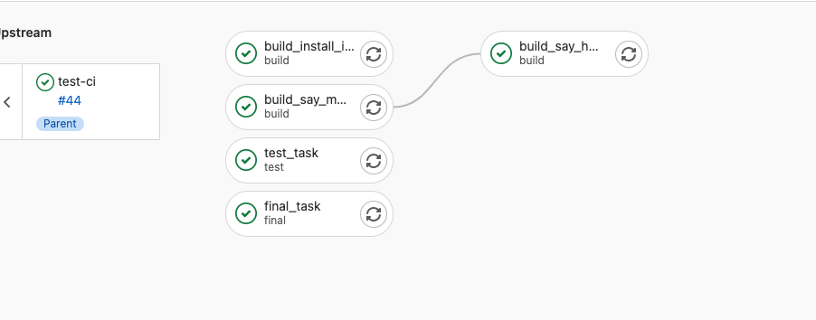

Finally, you can decide to cut into several steps one job by using a specific syntax:

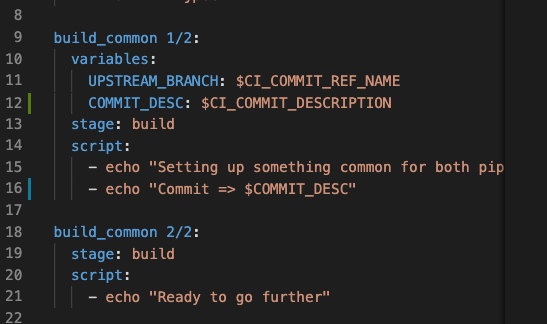


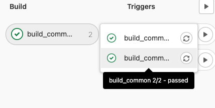

Source: https://docs.gitlab.com/ee/ci/pipelines/pipeline_architectures.html

#### Smaller scale customization

You can also add some scripts to be runned before or after a job, either before each one or before one specific job,
with the ability to overwrite them.

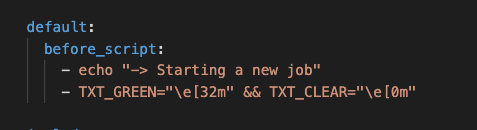

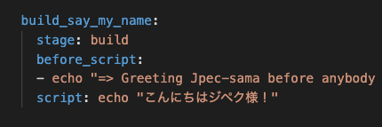

#### Decide when you run job

Outside the general pipeline process order, the keyword `when` enables the developer to define with more granularity 
the workflow.

You can for instance use this to run a specific job **ONLY** when a job in a previous stage's job fails or **ONLY** 
when you decide to launch it through the gitlab CI.
This can be useful to run cleanup code in case of a build error or to launch a deployment script through the UI once
all the tests have passed (and are correct...).

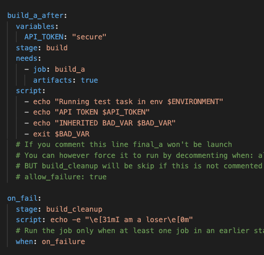

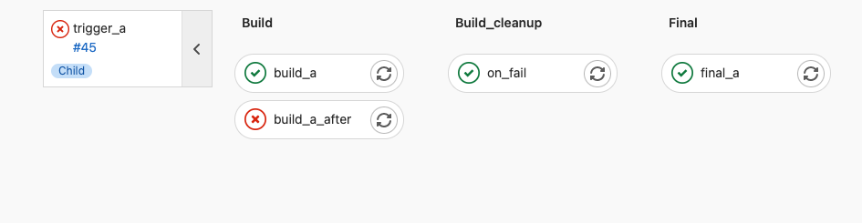

Finally, we can decide if the next stage should continue or not with the help of the `allow_failure` keyword or
even the `when: always` statement.

### Variables

You can define global variables and override them at job's level:

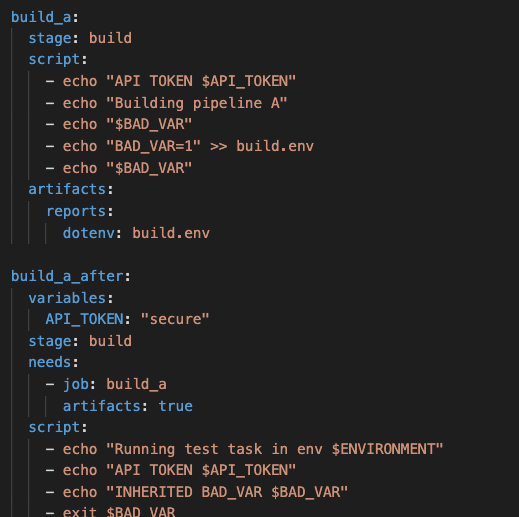

Source: https://docs.gitlab.com/ee/ci/variables/
Nevertheless, **to keep a CI/CD variable secret**, put it in the project settings, not in the .gitlab-ci.yml file.
(Go to your project’s Settings > CI/CD and expand the Variables section.)

A huge amount of predefined variables is available in GitLab to help the developer build customized experiences.

A list is available there: https://docs.gitlab.com/ee/ci/variables/predefined_variables.html

#### Pass variable to another job

You have the ability to pass variable through the `artifacts` keyword.

```
build_a_after:
  stage: build
  needs:
    - job: build_a
      artifacts: true
```

Equivalent to:

```
build_a_after:
  stage: build
  dependencies:
    - build_a
```

Source: https://docs.gitlab.com/ee/ci/variables/#pass-an-environment-variable-to-another-job

### Static Application Security Testing (SAST)

> If you’re using GitLab CI/CD, you can use Static Application Security Testing (SAST) **to check your source code for known vulnerabilities**.

Source: https://docs.gitlab.com/ee/user/application_security/sast/#customizing-the-sast-settings


## Looking further

### Caching and artifacts

#### Caching

To improve performance, use at your advantage the caching abilities of gitlab (disable by default)
https://docs.gitlab.com/ee/ci/caching/

Example use cases : downloading something from the internet

#### Artifact

Example use case : pass intermediate build results between stages

**NB:** Both artifacts and caches define their paths relative to the project directory, and can’t link to files outside it.

### Make reference to reuse code

Yaml syntax to create a ref:

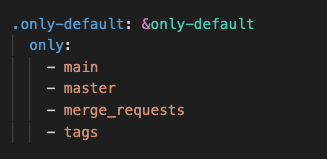

Yaml syntax to use a ref:

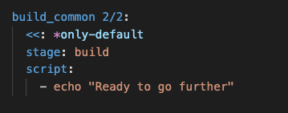

### Decide when your CI run

You probably don't want to run the full CI for all branches (for instance feature branches). 
In this case, two options are available:

- `rules` keyword

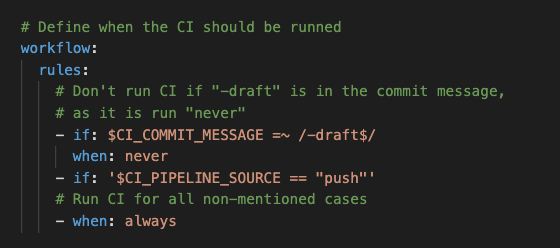

https://docs.gitlab.com/ee/ci/yaml/#workflow

- `only` or `except` keywords:
  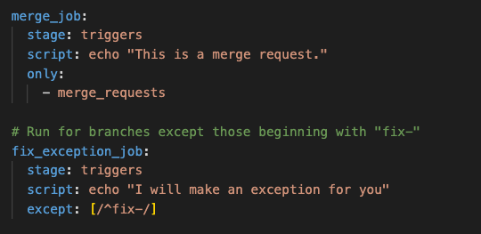

### Link GitLab and Teams

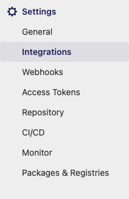

#### Other web hooks

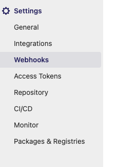

Deprecated: 
https://blog.axway.com/dev-insights/link-gitlab-and-microsoft-teams
